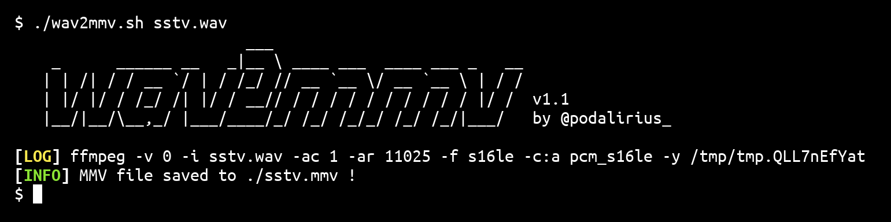

  A ffmpeg wrapper to convert a file from wav to mmv file to use in input of MSSTV
   
  
  
   

This script converts a file from WAV format to MMV format. You can then use the MMV file in input of [MMSSTV](https://hamsoft.ca/pages/mmsstv.php) to decode Slow Scan Television (SSTV) sound signals.

## Features

 - [x] Converts a file from WAV format to MMV format

## Demo

## Contributing

Pull requests are welcome. Feel free to open an issue if you want to add other features.

